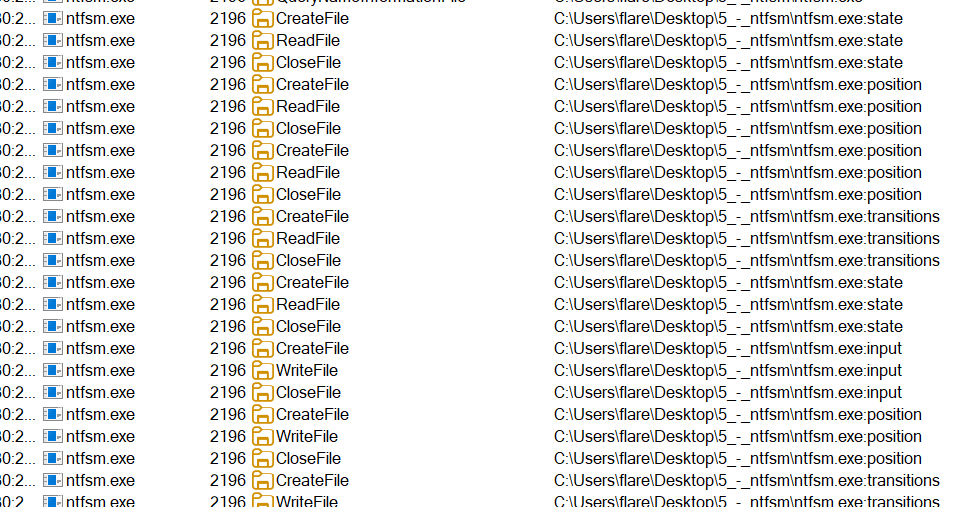
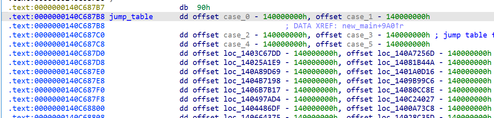

# 5 - ntfsm
## Overview
The binary expects a 16-byte password. 

The main interesting part of this binary is that it stores runtime information in NTFS Alternate Data Streams (`:state`, `:position`, `:transitions`, `:input`)

It implements a Finite State Machine (FSM) that validates each input character. 

If the FSM finishes with position == 0x10 and transitions == 0x10, the program derives an AES-256 key from SHA256(input) and decrypts an embedded ciphertext with AES-CBC to reveal the flag:

```
f1n1t3_st4t3_m4ch1n3s_4r3_fun@flare-on.com
```

## Explanation
- The binary is ~20 MB and causes IDA to freeze if autoanalysis is allowed to run completely. To counter this I disabled automatic analysis after analysis was done up to a certain point.
- Using procmon to analyze, the binary opens NTFS ADS on itself and uses these streams to record progress:

|Stream name|Size|Data|
|-|-|-|
|`:state`|0x8|Current FSM state|
|`:position`|0x8|Current input index|
|`:transitions`|0x8|Count of state changes|
|`:input`|0x10|The password|



The main switch/jump table controlling the FSM is located at 0x140C687B8.


FSM Behaviour:
- For each character, the program checks a small set of acceptable characters that cause transitions to the next state. If no acceptable character matches the current input character, the input path fails.
- The program increments position and spawns a new process to evaluate the next character (so ADS are used as an inter-process state store).

Victory condition:
- When `position == 0x10` and `transitions == 0x10`, the program treats `:input` as the correct password, derives the key with SHA256, decrypts the ciphertext using the deterministic IV, and prints the flag.

## Solution
1. Extract FSM

I extracted transitions and states of the FSM using `get_states.py`. But because of race conditions in IDAPython, the output in `out.json` isn't completely accurate.

2. Find all passwords

From the transition graph produced by `get_states.py`, I used DFS (`get_possible.py`) starting from state 0 to enumerate all possible 16-byte input strings that produce exactly 16 transitions and end at the accepting configuration. 

This produced a finite set of candidates (small enough to brute-force final decryption).

3. Decrypt

For each candidate password, compute `key = SHA256(password)` and attempt AES-CBC decryption of the ciphertext using the IV extracted from the binary. Print result if `flare` is in the plaintext.

Output of `decrypt.py`:
```
Password: iqg0nSeCHnOMPm2Q
b'f1n1t3_st4t3_m4ch1n3s_4r3_fun@flare-on.com'
```

4. Helper script

`reset.py` was used to inspect and overwrite ADS streams for testing: list streams and dump their bytes to disk and write test inputs.


## Challenges
1. I was too hung up on trying to get the race conditions correctly, instead of going to reverse the `decrypt_flag` function and brute force all the passwords I found
2. I wasted a lot of time because of the auto-analysis of IDA which kept crashing it. I should have stopped auto-analysis already if I knew it was going to crash.